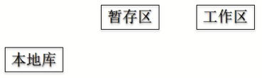
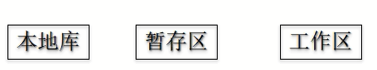

## 1 git的结构


<!-- more -->

## 2 git和代码托管中心

代码托管中心的作用是维护远程库。

常用的代码托管中心：gtihub、码云。

也可以自己搭建代码托管中心，例如gitlab。

## 3 git命令行操作

### 3.1 本地库初始化

```bash
git init
```

> 命令`git init`，执行成功后会在目录下创建一个`.git`的文件夹，`.git`目录中存放的是本地库相关的文件和子目录。

### 3.2 设置签名

【形式】：

- 用户名：enhao
- email地址：liangenhao@hotmail.com

【作用】：区分不同开发人员的身份

【辨析】：这里设置的签名和登录远程库（代码托管中心）的账号、密码没有任何关系。

【命令】：

项目级别/仓库级别：仅在当前本地库范围内有效。

```bash
git config user.name enhao
git config user.email liangenhao@hotmail.com
```

> git会把设置好的信息存放在当前项目本地库的`/.git/config`文件中。

系统用户级别：

```bash
git config --global user.name enhao_glb
git config --global user.email liangenhao_glb@hotmail.com
```

> 信息存放在系统中的`.gitconfig`文件中，windows系统在`C:\Users\enhao`目录下。linux系统在`~/.gitconfig`

> 优先级：就近原则，项目级别优先级高于系统用户级别，二者都有时，采用项目级别。

### 3.3 提交、查询状态

【查看本地库、暂存区的状态】：

```bash
git status
```

添加一个文件`good.txt`。使用`git status`命令：

```
On branch master

Initial commit

Untracked files:
  (use "git add <file>..." to include in what will be committed)

        good.txt

nothing added to commit but untracked files present (use "git add" to track)
```

> 提示本地库中没有提交。但有一个未被追踪的文件：`goot.txt`，可以使用`git add`追踪这个文件（添加到暂存区）。

【将工作区的新建/修改添加到暂存区】：

```bash
git add <file>
```

【将暂存区的内容提交到本地库】：

```bash
git commit -m "提交信息" <file>
```

> 修改的文件想要提交，可以先`git add`，然后再`git commit`。获取可以直接使用`git commit -a`。

### 3.4 查看提交日志

【查看提交日志】：

```bash
git log
```

简洁的方式显示日志：在一行中显示

```bash
git log --pretty=oneline
```

或者

```bash
git log --oneline
```

> 这样的hash值只显示一部分。

【查看所有分支的所有操作】：包括已经被删除的commit记录和reset记录。

```
git reflog
```

### 3.5 版本前进和后退

【本质】：git有一个HEAD指针，对版本的前进和后退其本质就是操作这个HEAD指针的前进和后退。

一、【方式一：基于索引值操作】（推荐）

```bash
git reset --hard 索引值
```

> 索引值是每次提交记录中的hash值。

二、【方式二：使用`^`符号】：<u>只能回退。</u>

```bash
git reset --hard HEAD^
```

> 每一个`^`符号表示回退一个版本。

三、【方式三：使用`~`符号】：<u>只能回退。</u>

如果回退的版本很多，就要写很多个`^`符号，这样不友好。可以使用`~`符号：

```bash
git reset --hard HEAD~3
```

> `~`符号后的数字表示回退几个版本。

#### 3.5.1 git reset 的参数

`--soft`：

- 仅仅在本地库移动HEAD指针。

  

`--mixed`：（默认参数）

- 在本地库移动HEAD指针。

- 重置暂存区。

  

`--hard`：（常用  ）

- 在本地库移动HEAD指针。

- 重置暂存区。

- 重置工作区。

  

#### 3.5.2 删除文件并找回

前提：删除前，文件存在时的状态提交到了本地库。

操作：`git reset --hard [指针位置/索引值]`

- 删除操作已经提交到本地库：指针位置指向历史纪录（索引值）。
- 删除操作尚未提交到本地库：指针位置指向HEAD。

### 3.6 比较文件差异

【和暂存区里的文件比较】：

```bash
git diff <file>
```

> 把修改的文件`git add`添加到暂存区后，使用该命令比较就没有差异了。

【和本地库里某个版本文件比较】：

```bash
git diff 指针位置/索引值 <file>
```

例如：`git diff HEAD^ good.txt`：和HEAD指针的上一个版本进行比较。

> 如果命令中不指定文件名，则比较工作区中所有的文件。

### 3.7 分支管理

git仓库在初始化之后就会有个默认分支：master  

【创建分支】：

```bash
git branch [分支名]
```

【查看分支】：

```bash
git branch -v
```

【切换分支】：

```bash
git checkout [分支名]
```

【合并分支】：

- 第一步：切换到接受修改的分支上（例如：把hotfix分支合并到master分支上，则我们必须在master分支上）

  ```bash
  git checkout [被合并的分支名]
  ```

- 第二步：执行merge命令

  ```bash
  git merge [需要合并的分支名]
  ```

【解决冲突】：

一、冲突的表现

```
<<<<<<< HEAD
private String test1;
private boolean flag;
=======
private String test2;
private Integer num;
>>>>>>> e9f293eb9ce2eb9c30e6f83bf3be5faf5cc7c66e
```

其中：

```
<<<<<<< HEAD
private String test1;
private boolean flag;
```

是当前分支的内容。

```bash
private String test2;
private Integer num;
>>>>>>> e9f293eb9ce2eb9c30e6f83bf3be5faf5cc7c66e
```

是`e9f293eb9ce2eb9c30e6f83bf3be5faf5cc7c66e`分支（需要合并到当前分支的分支）的内容。

二、冲突的解决

第一步：编辑文件，选择你需要的内容，删除冲突的符号。

第二步：`git add [文件名]`

第三步：`git commit -m "提交日志"`

> 注意，<u>此时的commit操作，不能带有文件名。</u>