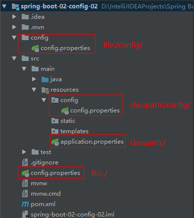

## 1 Spring Boot 配置文件

Spring Boot 使用一个全局的配置文件。配置文件有两种类型：`application.properties`或者`application.yml`。配置文件放置在`src/main/resources`目录下。配置文件名是固定的。

配置文件的作用：修改 Spring Boot 自动配置的默认值。

<!-- more -->

### 1.1 YAML 语法

YAML是以数据为中心，而不是以置标语言为重点 ，比xml更适合做配置文件。

#### 1.1.1 基本语法

`key: value`：表示一对键值对。注意：<u>key 和 value 之间必须要有空格</u>。

以空格的缩进来控制层级关系；只要是左对齐的一列数据，都是同一个层级的。

属性和值是大小写敏感的。

```yaml
server:
	port: 8081
	path: /hello
```
#### 1.1.2 值的写法

一、【字面量】：普通的值（数字、字符串、布尔）。

字面量直接来写，字符串默认不用加上单引号或者双引号。

`""`：双引号，不会转义字符串里面的特殊字符。特殊字符原样输出。

`''`：单引号，会转义字符串里面的特殊字符。

二、【对象、Map（属性和值）】：

值是对象的时候，还是用`key: value`的形式，表示值。

```yaml
friend:
	firstName: liang
	lastName: enhao
	age: 18
```

行内写法：

```yaml
friend: {firstName: liang, lastName: enhao, age: 18}
```

三、【数组（List、Set）】：

用`- 值`的方式表示数据中的一个元素。

```yaml
pets:
	- cat
	- dog
	- pig
```

行内写法：

```yaml
pets: [cat, dog, pig]
```

### 1.2 配置文件值获取： @ConfigurationProperties

#### 1.2.1 使用方法

首先，YAML配置文件属性如下：

```yaml
person:
  lastName: enhao
  age: 18
  boss: false
  birth: 2018/06/17
  map: {key1: xixixi, key2: 12}
  lists:
    - zhangsan
    - lisi
  dog:
    name: dog
    age: 2
```

要想配置文件的值和bean的值一一绑定，需要使用`@ConfigurationProperties`。**该注解默认从全局配置文件`application.properties/application.yml`中获取值。**

```java
@Component
@ConfigurationProperties(prefix = "person")
public class Person {
    private String lastName;
    private Integer age;
    private Boolean boss;
    private Date birth;

    private Map<String, Object> map;
    private List<Object> list;
    private Dog dog;
}
```

通过属性`prefix`指定前缀，只要是指定前缀的key，Spring Boot 就会将该前缀key的value映射到标注了`@ConfigurationProperties`注解的bean中。

> 导入配置文件处理器，在编写配置文件时就可以有提示了。
>
> ```xml
> <dependency>
>     <groupId>org.springframework.boot</groupId>
>     <artifactId>spring-boot-configuration-processor</artifactId>
>     <optional>true</optional>
> </dependency>
> ```

#### 1.2.2 @ConfigurationProperties 和 @Value 区别

`@ConfigurationProperties` 和 `@Value`都可以获取到配置文件中的值，但他们有一些区别：

|                           | @ConfigurationProperties | @Value       |
| ------------------------- | ------------------------ | ------------ |
| 功能                      | 批量注入配置文件中的属性 | 一个一个指定 |
| 松散绑定（松散语法）      | 支持                     | 不支持       |
| SpEL（`#{}`）             | 不支持                   | 支持         |
| JSR303数据校验            | 支持                     | 不支持       |
| 复杂类型封装（Map，List） | 支持                     | 不支持       |

> 松散绑定：对属性名称匹配规则：
>
> - 标准的：`person.lastName`
> - 松散语法：`person.last-name`

> JSR303数据校验：可以使用`@Validated`进行数据校验。
>
> ```java
> @Component
> @ConfigurationProperties(prefix = "person")
> @Validated
> public class Person {
>     @Email
>     private String email;
> }
> ```
>
> 校验必须时email格式的。

总结：我们只是在某个业务逻辑中需要获取一下配置文件中的某项值，使用`@Value`注解。如果我们专门编写一个JavaBean来和配置文件进行映射，我们就直接使用`@ConfigurationProperties`。

### 1.3 加载指定配置文件：@PropertySource

由于`@ConfigurationProperties`注解默认是从全局配置文件`application.properties/application.yml`中获取值的。如果要从其他配置文件中获取值时，就需要使用`@PropertySource`，来读取指定的配置文件，其属性`value`可以指定一个数据值，读取多个配置文件的值。

```java
@Component
@ConfigurationProperties(prefix = "person")
@PropertySource(value = {"classpath:person.properties"})
public class Person {
    private String lastName;
}
```

> 读取类路径下`person.properties`配置文件。并将其映射到bean中。

### 1.4 导入Spring的配置文件：@ImportResource

Spring Boot 项目里面没有Spring的配置文件，我们自己编写的Spring配置文件不能自动的识别。如果想让Spring的配置文件生效，就需要使用`@ImportResource`。将其标注在一个配置类上。

> 感觉没啥用 (￣▽￣)"

```java
@SpringBootApplication
@ImportResource(locations = {"classpath:applicationContext.xml"})
public class SpringBoot02ConfigApplication {
    public static void main(String[] args) {
        SpringApplication.run(SpringBoot02ConfigApplication.class, args);
    }
}
```

### 1.5 配置文件占位符

YAML和properties两种形式的配置文件都支持占位符。

一、【占位符获取随机数】：

```yaml
${random.value}、${random.int}、${random.long}
${random.int(10)}、${random.uuid}
```

二、【占位符获取之前配置的值，如果没有可以用`:`指定默认值】：

```yaml
person.last-name=enhao ${random.uuid}
person.dog.name=${person.last-name}_dog
person.age=${person.age:18}_3
```

## 2 配置文件加载位置

Spring Boot 启动的时候会扫描以下位置的`application.properties`或者`application.yml`文件作为默认配置文件。

- `file:/config/`
- `file:./`
- `classpath:/config/`
- `classpath:/`

以上优先级**由高到低**，所有位置的文件都会被加载，**高优先级配置内容会覆盖低优先级配置内容**。



我们还可以通过`spring.config.location`来改变默认的配置文件的位置。

通常是项目打包好后，我们可以使用命令行参数的形式，启动项目的时候来指定配置文件的新位置。**指定配置文件和默认加载的这些配置文件共同起作用形成互补配置。**

## 3 外部配置加载顺序

SpringBoot也可以从以下位置加载配置； 优先级从高到低；高优先级的配置覆盖低优先级的配置，所有的配置会形成互补配置。

1. **命令行参数** 。
2. 来自java:comp/env的JNDI属性 
3. Java系统属性（`System.getProperties()`） 
4. 操作系统环境变量 
5. `RandomValuePropertySource`配置的`random.*`属性值 
6. **jar包外部的`application-{profile}.properties`或`application.yml(带spring.profile)`配置文件。** 
7. **jar包内部的`application-{profile}.properties`或`application.yml(带spring.profile)`配置文件。 **
8. **jar包外部的`application.properties`或`application.yml(不带spring.profile)`配置文件 。**
9. **jar包内部的`application.properties`或`application.yml(不带spring.profile)`配置文件。** 
10. `@Configuration`注解类上的`@PropertySource `。
11. 通过`SpringApplication.setDefaultProperties`指定的默认属性 。

> 着重关注1、6、7、8、9。
>
> 由jar包外向jar包内进行寻找。优先加载带profile。

## 4 Profile 多环境支持

Profile 是 Spring 对不同环境提供不同配置的支持，可以通过激活、指定参数等方式快速切换环境。

### 4.1 方式一：多个profile文件方式

主配置文件使用格式为：`application-{profile}.properties`。编写不同环境的配置文件。

默认使用的是`application.properties`文件。

可以使用`spring.profile.active`来激活指定的profile。

### 4.2 方式二：YAML多文档块方式

在YAML配置文件中，使用`---`来将配置文件划分为多个文档块。

```yaml
spring:
  profiles:
    active: dev
---
spring:
  profiles: dev
server:
  port: 8081
---
spring:
  profiles: prod
server:
  port: 8082
```

使用`spring.profiles`来指定该文档块的名称。

可以在第一个文档块中使用`spring.profiles.active`指定激活的文档块。

### 4.3 激活profile

一、【方式一：`spring.profile.active`】：

在配置文件中使用`spring.profile.active`来激活指定的proflie。

```properties
spring.profile.active=dev
```

二、【方式二：命令行方式】：

`--spring.profiles.active=dev`


三、【方式三：虚拟机参数】：

`-Dspring.profiles.active=dev`


> 