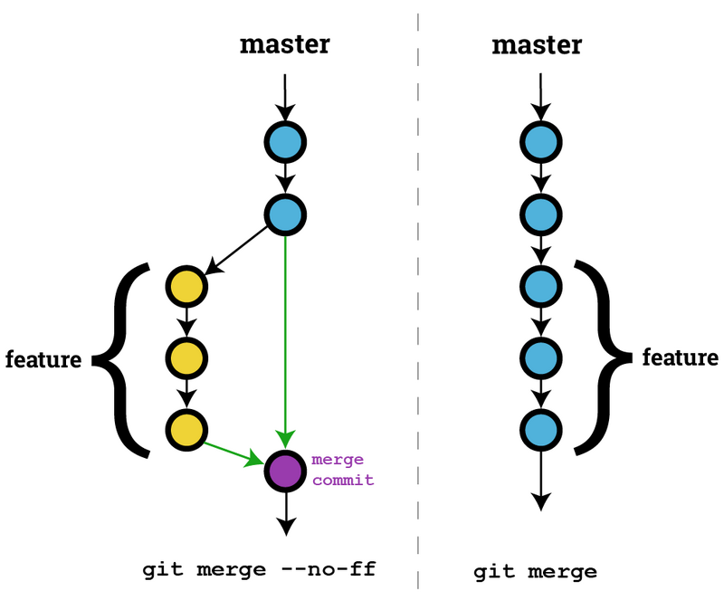

## 1 git flow 工作流


Git Flow 定义了五种分支标准：

主要分支（长期分支）：

- master：主分支

- develop：开发分支

  > 来源：master分支。

辅助分支：

- feature：功能分支

  > 来源：develop分支。
  >
  > 去向：合并回develop分支，并删除该feature分支。

- hotfix：热修复分支

  > 来源：master分支。
  >
  > 去向：合并回master分支和develop分支，并删除该hotfix分支。

- release：预发布分支

  > 来源：develop分支。
  >
  > 去向：合并回master分支和develop分支，并删掉该release分支。

<!-- more -->

## 2 主要分支

主要分支只用于与软件测试、部署、发布相关的活动，不会涉及任何的软件开发活动。主要分支会一直存在。

### 2.1 master

master分支上存放的是随时可供在生产环境中部署的代码。

它只用于新版本的发布，不涉及一切与开发、测试、部署相关的操作。

往master分支合并后，都要打上标签（Tag）。

### 2.2 develop

develop分支fork自master分支，主要用于开发。从develop分支拉出feature分支。新功能完成后，将feature分支合并到develop分支。

## 3 辅助分支

辅助分支主要用于具体的软件开发工作，包括新功能的开发、Bug修复和发布前的准备工作。辅助分支不是一直存在的，当它们被合并到主要分支后，会被删除掉。 

### 3.1 feature

开发者不能直接在master分支和develop分支上做开发工作。git flow要求**从develop分支上引出一条feature分支**，专门做具体的开发工作。

开发完成后，**把feature分支合并到develop分支上**，**然后把feature分支删掉。**

### 3.2 hotfilx

当线上产品遇到了严重的bug，或者紧急的缺陷。可以**从master分支上拉出一条hotfix分支**。问题解决后，**把hotfix分支合并到master分支和develop分支**。

### 3.3 release

新功能开发完成后，代码都合并到了develop分支后，就可以为发布做准备了。但是如果这时有新的开发任务到来，或者又有新的分支需要合并，而此时的develop分支又没有准备好合并到master分支时，那么就可以**从develop分支引出一条release分支作为过渡。** 

在release分支上，完成发布前的准备工作，如果有bug，可直接在release分支上修改并测试通过，然后**合并到master分支和develop分支，最后删除release分支。** 

## 4 Merge 加上 no-ff 参数

需要说明的是，Git Flow 的作者 Vincent Driessen 非常建议，合并分支的时候，加上 no-ff 参数，这个参数的意思是不要选择 Fast-Forward 合并方式，而是策略合并，策略合并会让我们多一个合并提交。这样做的好处是保证一个非常清晰的提交历史，可以看到被合并分支的存在。 



```bash
git merge --no-ff [分支名]
```

## 5 git flow 命令集

git flow 对git的原生命令进行了简化来进行分支管理。

【初始化】：

```bash
git flow init
```

【创建新Feature】：

```bash
git flow feature start [分支名]
```

【将一个feature分支推到远程服务器】：

```bash
git flow feature publish [分支名]
或者
git push origin feature/[分支名]
```

【完成feature】：

```bash
git flow feature finish [分支名]
```

> 该命令会把`feature/[分支名]`合并到develop分支，然后删除该功能分支。

【创建release分支】：

```bash
git flow release start [分支名]
```

【完成release分支】：

```bash
git flow release finish [分支名]
```

> 该命令会把`release/[分支名]`合并到master分支和develop分支，并删除该release分支。

【创建一个hotfix分支】：

```bash
git flow hotfix start [分支名]
```

【完成一个hotfix分支】：

```bash
git flow hotfix finish [分支名]
```

> 该命令会把`hotfix/[分支名]`合并到master分支和develop分支，并删除该hotfix分支。

SourceTree支持图形化操作git flow。