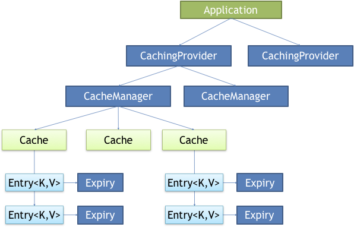
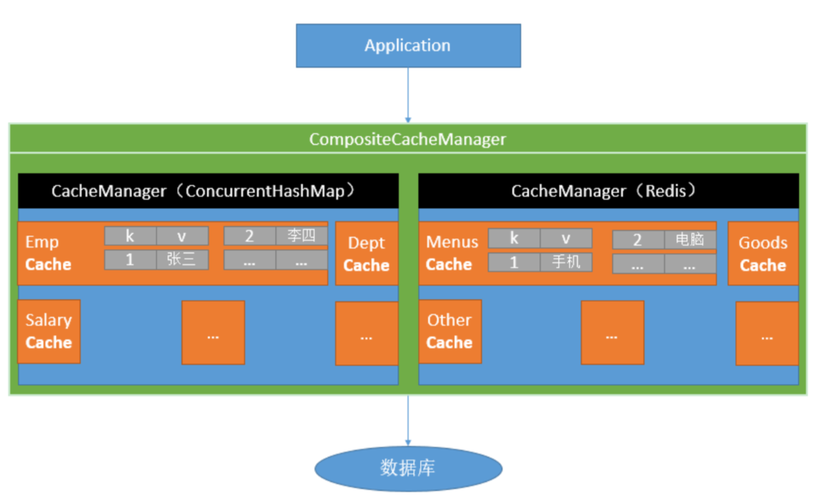
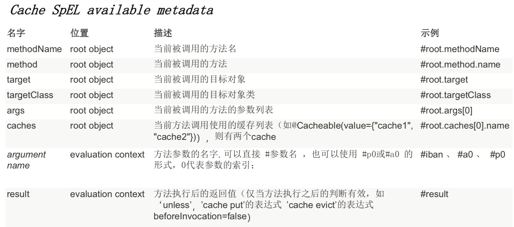

## 1 Java缓存规范 JSR107

Java Caching 定义了5个核心接口，分别是`CachingProvider`、`CacheManager`、`Cache`、`Entry`和`Expiry`。

- `CachingProvider`：缓存提供者。定义了创建、配置、获取、管理和控制多个`CacheManager`。一个应用可以在运行期访问多个`CachingProvider`。
- `CacheManager`：缓存管理器。定义了创建、配置、获取、管理和控制多个唯一命名的`Cache`，这些`Cache`存在于`CacheManager`的上下文中。一个`CacheManager`仅被一个`CachingProvider`所拥有。
- `Cache`：缓存。是一个类似Map的数据结构并临时存储以Key为索引的值。一个`Cache`仅被一个`CacheManager`所拥有。
- `Entry`：是一个存储在`Cache`中的key-value对。
- `Expiry`：有效期。每一个存储在`Cache`中的条目有一个定义的有效期。一旦超过这个有效期，条目为过期的状态。一旦过期，条目将不可访问、更新和删除。缓存有效期可以通过`ExpiryPolicy`设置。



<!-- more -->

想要使用JSR107规范，需要引入`cache-api`依赖：

```xml
<dependency>
    <groupId>javax.cache</groupId>
    <artifactId>cache-api</artifactId>
</dependency>
```


## 2 Spring 缓存抽象

Spring 从3.1开始定义了`org.springframework.cache.Cache`和`org.springframework.cache.CacheManager`接口来统一不同的缓存技术。并**支持使用`JCache`(JSR-107)**注解简化开发。

### 2.1 重要概念和核心注解

一、【重要概念】：

`Cache`：缓存接口，定义缓存操作。实现有：`RedisCache`、`EhCacheCache`、`ConcurrentMapCache`等。

`CacheManager`：缓存管理器，管理各种缓存（Cache）组件。



二、【核心注解】：

`@EnableCaching`：开启基于注解的缓存。

`@Cacheable`：主要针对方法配置，能够根据方法的请求参数对其结果进行缓存。

> 第一次调用方法会根据参数取数据库中查出结果，将查出的结果放入缓存中，以后查询相同的内容，直接从缓存中获取。

`@CacheEvict`：清空缓存。

> 如果删除一条数据，在删除数据的同时，缓存中的信息也应该被删除。

`@CachePut`：更新缓存。保证方法被调用，又希望结果被缓存。

> 对一条数据进行更新时，更新数据库的同时，缓存中的信息也应该被更新。

三、【其他注解】：

`Caching`：通常如果一个方法有复杂的缓存规则时使用。`Caching`可以同时指定`@Cacheable`、`@CacheEvict`和`@CachePut`来满足需求。

`CacheConfig`：抽取缓存的公共配置，包括：`cacheNames`、`keyGenerator`、`cacheManager`、`cacheResolver`。

四、【`@Cacheable`、`@CacheEvict`和`@CachePut`共有的属性】：

`cacheNames/value`：指定缓存组件的名字。是数组的方式，可以指定多个缓存。

> `CacheManager`管理多个`Cache`组件，对缓存的真正crud操作在`Cache`组件中，每一个缓存组件都有自己唯一的名字。

`key`：缓存数据时使用的键，**默认是使用方法参数的值做为key**，key也可以使用SpEL表达式。

> ```java
> // key="#id"：将参数id的值作为key。
> @Cacheable(cacheNames="emp", key="#id")
> public Employee getEmp(Integer id) {   
> }
> ```
>
> 可以编写的SpEL表达式如下：
>
> 

`keyGenerator`：key的生成器。可以自己指定key的生成器的组件id。

> **`key`和`keyGenerator`两个属性互斥**，只能指定其中一个。

`cacheManager`：指定缓存管理器。

> `cacheManager`和`cacheResolver`两个属性是互斥的，只能指定其中一个。

`cacheResolver`：指定缓存解析器。

`condition`：指定符合条件的情况下才缓存。使用SpEL表达式编写。返回 true或者 false，只有为 true 才进行缓存/清除缓存，在调用方法之前之后都能判断。

> ```java
> // condition="#id>0"：当参数id的值大于0的时候，才将方法运行的结果进行缓存。
> @Cacheable(cacheNames="emp", condition="#id > 0")
> public Employee getEmp(Integer id) {
> }
> ```

五、【`@Cacheable`和`@CachePut`共有的属性】：

`unless`：否认缓存。不像condition，该表达式只在方法执行之后判断，此时可以拿到返回值result进行判
断。条件为true不会缓存，fasle才缓存。

> ```java
> // unless="#result == null"：当返回的结果为null，就不进行缓存。
> @Cacheable(cacheNames="emp", condition="#id > 0", unless="#result == null")
> public Employee getEmp(Integer id) {
> }
> ```

六、【`@Cacheable`特有属性】：

`sync`：是否使用异步模式。

> 注意：异步模式下，`unless`属性就不起作用了。

七、【`@CacheEvict`特有属性】：

`allEntries`：是否清空所有缓存内容，默认为false。如果指定为true，则方法调用后将立即清空所有缓存。

`beforeInvocation`：是否在方法执行前就清空，默认为 false（在方法执行后清除缓存），如果指定为 true，则在方法还没有执行的时候就清空缓存，默认情况下，如果方法执行抛出异常，则不会清空缓存。

### 2.2 Spring Boot 使用缓存

一、【环境搭建】：

工程中需要引入`spring-boot-starter-cache`依赖。持久化框架以mybatis、数据库以mysql为例：

```xml
<dependency>
    <groupId>org.springframework.boot</groupId>
    <artifactId>spring-boot-starter-web</artifactId>
</dependency>
<dependency>
    <groupId>org.springframework.boot</groupId>
    <artifactId>spring-boot-starter-cache</artifactId>
</dependency>
<dependency>
    <groupId>org.mybatis.spring.boot</groupId>
    <artifactId>mybatis-spring-boot-starter</artifactId>
    <version>1.3.2</version>
</dependency>

<dependency>
    <groupId>mysql</groupId>
    <artifactId>mysql-connector-java</artifactId>
    <scope>runtime</scope>
</dependency>
```

配置数据源：

```properties
spring.datasource.url=jdbc:mysql://localhost:3306/springboot-cache
spring.datasource.username=root
spring.datasource.password=root
spring.datasource.driver-class-name=com.mysql.jdbc.Driver # 可省略
```

> 如果引入的mysql驱动的依赖的scope是runtime。则IDEA会报错：cannot resolve class or package 'xxx'。原因是该依赖只在运行时生效，编译器不生效。不影响程序的运行。将scope删除，就不报错了。

配置mybatis：

```properties
# 开启驼峰命名匹配规则
mybatis.configuration.map-underscore-to-camel-case=true
```

准备model、service、mapper。

二、【使用缓存】：

1. 开启基于注解的缓存。使用`@EnableCaching`。
2. 使用`@MapperScan`扫描mapper。
3. 标注注解。

### 2.3 Spring Boot 缓存的工作原理

#### 2.3.1 自动配置原理

一、【加载自动配置类】：在Spring Boot中如果我们引入了缓存模块，那么缓存的自动配置`CacheAutoConfiguration`就会生效。

二、【导入缓存的配置类】：通过查看`CacheAutoConfiguration`的源码，使用`@Import({CacheAutoConfiguration.CacheConfigurationImportSelector.class})`注解，向容器中导入了`CacheConfigurationImportSelector`类，该类的作用是向容器中导入一些缓存需要的组件。

导入的缓存组件有：

```
org.springframework.boot.autoconfigure.cache.GenericCacheConfiguration
org.springframework.boot.autoconfigure.cache.JCacheCacheConfiguration
org.springframework.boot.autoconfigure.cache.EhCacheCacheConfiguration
org.springframework.boot.autoconfigure.cache.HazelcastCacheConfiguration
org.springframework.boot.autoconfigure.cache.InfinispanCacheConfiguration
org.springframework.boot.autoconfigure.cache.CouchbaseCacheConfiguration
org.springframework.boot.autoconfigure.cache.RedisCacheConfiguration
org.springframework.boot.autoconfigure.cache.CaffeineCacheConfiguration
org.springframework.boot.autoconfigure.cache.SimpleCacheConfiguration 「默认」
org.springframework.boot.autoconfigure.cache.NoOpCacheConfiguration
```

三、【默认生效的缓存配置类】：**默认生效的是`SimpleCacheConfiguration`配置类。该配置类给容器中注册了一个`ConcurrentMapCacheManager`缓存管理器。**该缓存管理器，可以获取和创建`ConcurrentMapCache`缓存组件，他的作用是将数据保存在`ConcurrentMap`中。

#### 2.3.2 调用方法时缓存运行流程

一、【`@Cacheable`运行流程】：

1. 方法运行之前，先去查询`Cache`缓存组件，按照`cacheNames`指定的名字获取。

   > `CacheManager`先获取相应的缓存，第一次获取缓存会自动创建，如果没有`Cache`组件会自动创建。

2. 根据一个key，去`Cache`中查找缓存的内容。key默认是方法的参数。

   > key是按照某种策略生成的，默认使用`keyGenerator`生成的（如果注解上不指定key的话），默认使用`SimplekeyGenerator`生成key。
   >
   > `SimplekeyGenerator`生成key策略：如果没有参数，key=new SimpleKey();，如果有一个参数，key=参数值，如果有多个参数，key=new SimpleKey(params);

3. 没有查到缓存就调用目标方法。

4. 将目标方法返回的结果放进缓存中。以后再来调用通用的数据就可以直接使用缓存中的数据不用执行方法。

> 核心：
>
> 1. 使用`CacheManager`按照名字得到`Cache`组件。
> 2. key使用`keyGenerator`生成，默认使用`SimplekeyGenerator`。

二、【`@CachePut`运行流程】：

1. 先调用目标方法。
2. 将目标方法的结果缓存起来。

【注意】：使用`@CachePut`更新缓存遇到的疑问：

例：有两个服务方法，第一个方法根据员工id查询员工对象。第二个方法，更新员工信息。

```java
// 方法A：根据员工id查询员工对象
@Cacheable(cacheNames = "emp")
public Employee getEmp(Integer id) {
    return employeeMapper.getEmpById(id);
}
// 方法B：更新员工信息
@CachePut(value = "emp")
public Employee updateEmp(Employee employee) {
    employeeMapper.updateEmp(employee);
    return employee;
}
```

【场景】：第一步，首先调用方法A，查询id为1的员工信息，查询结果：`{"id":1, "lastName":"enhao"}`。此时，该结果被缓存；

第二步，调用方法B，更新id为1的员工信息，更新的内容：`{"id":1, "lastName":"张三"}`，方法执行完成后，更新的内容被缓存；

第三步，调用方法A，查询id为1的员工信息，此时发现，查询结果依然是`{"id":1, "lastName":"enhao"}`，并不是调用方法B后更新后的值，这是为什么呢？在调用方法B后，缓存的内容已经被更新了呀。

【解释】：首先需要明确的是，读取缓存是通过key来获取的。调用方法A，`{"id":1, "lastName":"enhao"}`内容被缓存了，此时缓存的key=1（默认为参数值）；然后调用方法B，更新的内容`{"id":1, "lastName":"张三"}`也被缓存了，但是注意，此时该缓存的key默认是参数employee的值，并不是方法A中的id值。因此，在第二次调用方法A查询员工时，是从key=1的缓存中获取内容，而不是从key=employee的值中获取内容，所以查询的结果未改变。

【解决】：解决这类问题很简单，只需要保持key一直就可以了。因此我们指定key。

```java
// 方法A：根据员工id查询员工对象
@Cacheable(cacheNames = "emp")
public Employee getEmp(Integer id) {
    return employeeMapper.getEmpById(id);
}
// 方法B：更新员工信息
@CachePut(value = "emp", key = "#employee.id")
public Employee updateEmp(Employee employee) {
    employeeMapper.updateEmp(employee);
    return employee;
}
```

此时将方法B缓存的key指定为id值，这样就和方法1的key保持一致，这样在更新后再读取，就可以获取最新的值了。

> 这里的`key = "#employee.id"`可以等价替换成`key = "#result.id"`。

### 2.4 整合redis实现缓存

Spring的缓存，默认使用的`CacheManager`缓存管理器是`ConcurrentMapCacheManager`。

但我们也可以使用一些缓存中间件，例如：redis、memcached、ehcache等等。

#### 2.4.1 环境搭建

一、【引入依赖】：

```xml
<dependency>
    <groupId>org.springframework.boot</groupId>
    <artifactId>spring-boot-starter-data-redis</artifactId>
</dependency>
```

二、【配置redis】：

在`application.properties`/`application.yml`中配置：

```properties
# 基础配置
spring.redis.host=127.0.0.1 
spring.redis.port=6379
spring.redis.timeout=3000
```

需要注意的是，Spring Boot 1.5.x和Spring Boot 2.x两个版本默认使用的redis客户端连接池是不同的。

| Spring Boot 版本 | 默认客户端类型 |
| ---------------- | -------------- |
| 1.5.x            | jedis          |
| 2.x              | lettuce        |

由于，在1.5.x版本中，只有jedis客户端连接池，所以配置jedis连接池只需要配置`spring.redis.pool.*`。

```properties
# 最大连接数
spring.redis.pool.max-active=8
# 最大连接等待时间
spring.redis.pool.max-wait=-1
# 最小空闲数
spring.redis.pool.min-idle=0
# 最大空闲数
spring.redis.pool.max-idle=8
```

由于在2.x版本中引入了不同的客户端连接池，因此需要指定配置哪种连接池。

```properties
#jedis客户端
spring.redis.jedis.pool.max-active=8
spring.redis.jedis.pool.max-wait=-1ms
spring.redis.jedis.pool.min-idle=0
spring.redis.jedis.pool.max-idle=8
#lettuce客户端
spring.redis.lettuce.pool.min-idle=0
spring.redis.lettuce.pool.max-idle=8
spring.redis.lettuce.pool.max-wait=-1ms
spring.redis.lettuce.pool.max-active=8
spring.redis.lettuce.shutdown-timeout=100ms
```

#### 2.4.2 自动配置原理

一、当我们引入了redis之后，则`RedisAutoConfiguration`自动配置类就生效了。

二、`RedisAutoConfiguration`类帮我们自动注入了`RedisTemplate`和`StringRedisTemplate`两个Bean。这个两个的作用就是用来操作redis。

> `RedisTemplate`操作的key-value都是对象。
>
> `StringRedisTemplate`操作的key-value都是字符串。

> `RedisTemplate`缓存的对象时，默认使用的是jdk序列化机制，因此缓存的对象需要实现序列化接口。但也可以指定序列化机制，可以更改成json序列化机制，便于阅读。

三、自动配置类生效后，`RedisCacheConfiguration`redis缓存配置类生效。

四、`RedisCacheConfiguration`配置类向容器中注册`RedisCacheManager`缓存管理器。该缓存管理器， 帮我们创建`RedisCache`来作为缓存组件，`RedisCache`通过操作redis缓存数据。

五、默认保存数据（key-value都是Object），是利用序列化保存。

#### 2.4.3 自定义CacheManager

在1.5.x版本中，我们使用`RedisTemplate`即可实例化一个`RedisCacheManager`：

```java
@Bean
public CacheManager cacheManager(RedisTemplate redisTemplate) {
    RedisCacheManager manager = new RedisCacheManager(redisTemplate);
    manager.setUsePrefix(true);
    RedisCachePrefix cachePrefix = new RedisPrefix("prefix");
    manager.setCachePrefix(cachePrefix);
    // 整体缓存过期时间
    manager.setDefaultExpiration(3600L);
    // 设置缓存过期时间。key和缓存过期时间，单位秒
    Map<String, Long> expiresMap = new HashMap<>();
    expiresMap.put("user", 1000L);
    manager.setExpires(expiresMap);
    return manager;
}
```

但在2.0版本中删除了这个构造方法，同时也不可以使用`setDefaultExpiration`方法设置默认的缓存过期时间了。

在2.0新版中，可以通过以下两种方式构造一个`RedisCacheManager`：

一、【方法一】：

```java
@Bean
public CacheManager cacheManager(RedisConnectionFactory factory) {
    RedisCacheManager cacheManager = RedisCacheManager.create(factory);
    return cacheManager;
}
```

使用`RedisCacheManager`的静态方法`create`构造的`RedisCacheManager`只是使用Spring的默认配置。

二、【方法二】：

通过Spring提供的`RedisCacheConfiguration`类，构造一个自己的redis配置类，从该配置类中可以设置一些初始化的缓存命名空间、及对应的默认过期时间等属性，再利用`RedisCacheManager`中的`builder.build()`的方式生成cacheManager。

> 需要注意的是，**这里使用的是Spring提供的`RedisCacheConfiguration`类，在`org.springframework.data.redis.cache`包下，并不是Spring Boot自动配置提供的`org.springframework.boot.autoconfigure.cache.RedisCacheConfiguration`类。**

```java
@Bean
public CacheManager cacheManager(RedisConnectionFactory factory) {
    // 生成一个默认配置，通过config对象即可对缓存进行自定义配置
    RedisCacheConfiguration config = RedisCacheConfiguration.defaultCacheConfig();  
    // 设置缓存的默认过期时间，也是使用Duration设置
    config = config.entryTtl(Duration.ofMinutes(1))     
        .disableCachingNullValues();     // 不缓存空值

    // 设置一个初始化的缓存空间set集合
    Set<String> cacheNames =  new HashSet<>();
    cacheNames.add("my-redis-cache1");
    cacheNames.add("my-redis-cache2");

    // 对每个缓存空间应用不同的配置
    Map<String, RedisCacheConfiguration> configMap = new HashMap<>();
    configMap.put("my-redis-cache1", config);
    configMap.put("my-redis-cache2", config.entryTtl(Duration.ofSeconds(120)));

    // 使用自定义的缓存配置初始化一个cacheManager
    RedisCacheManager cacheManager = RedisCacheManager.builder(factory)     
        .initialCacheNames(cacheNames)  // 注意这两句的调用顺序，一定要先调用该方法设置初始化的缓存名，再初始化相关的配置
        .withInitialCacheConfigurations(configMap)
        .build();
    return cacheManager;
}
```

注意：在自定义缓存配置的时候需要注意一点，`RedisCacheConfiguration`设置配置缓存的方法都是有返回值的，需要重新赋值给`config`对象(第6行)。

#### 2.4.4 自定义RedisTemplate

在使用redis缓存数据时，由于默认配置的`RedisTemplate`是使用`jdkSerializeable`对需要缓存的数据进行序列化的，这样缓存的结果不便于阅读，我们可以通过自定义`RedisTemplate`的方式指定序列化策略。

```java
@Bean
public RedisTemplate<Object, Object> redisTemplate(RedisConnectionFactory redisConnectionFactory) {
    RedisTemplate<Object, Object> redisTemplate = new RedisTemplate<>();
    redisTemplate.setConnectionFactory(redisConnectionFactory);

    // 使用Jackson2JsonRedisSerialize 替换默认序列化
    Jackson2JsonRedisSerializer jackson2JsonRedisSerializer = new Jackson2JsonRedisSerializer(Object.class);

    ObjectMapper objectMapper = new ObjectMapper();
    objectMapper.setVisibility(PropertyAccessor.ALL, JsonAutoDetect.Visibility.ANY);
    objectMapper.enableDefaultTyping(ObjectMapper.DefaultTyping.NON_FINAL);

    jackson2JsonRedisSerializer.setObjectMapper(objectMapper);

    // 设置value的序列化规则和 key的序列化规则
    redisTemplate.setValueSerializer(jackson2JsonRedisSerializer);
    redisTemplate.setKeySerializer(new StringRedisSerializer());
    redisTemplate.afterPropertiesSet();
    return redisTemplate;
}
```

