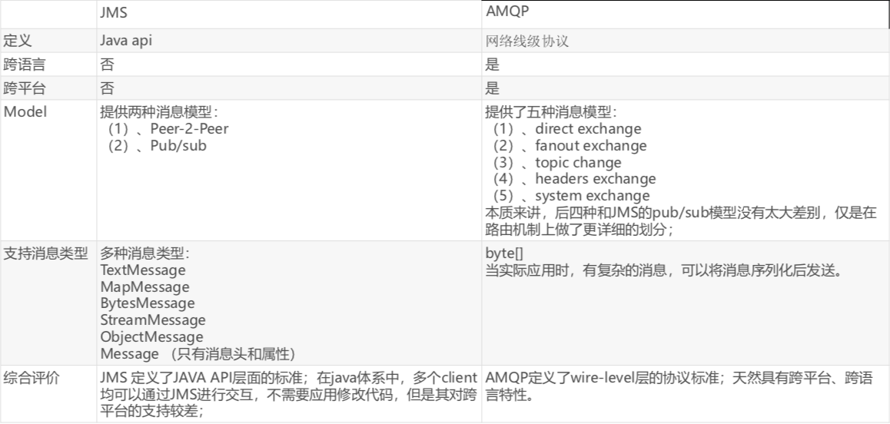
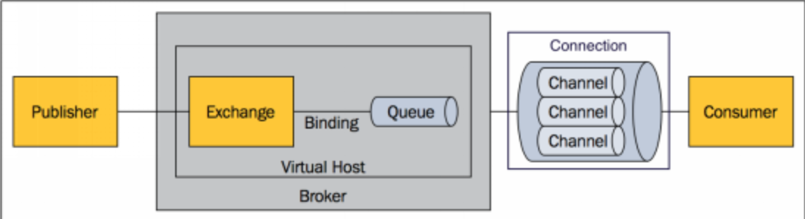
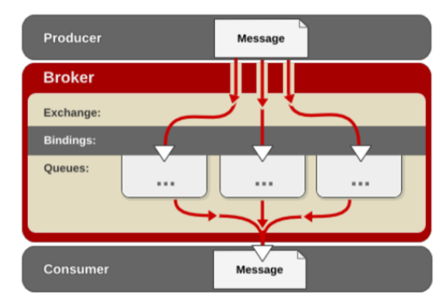
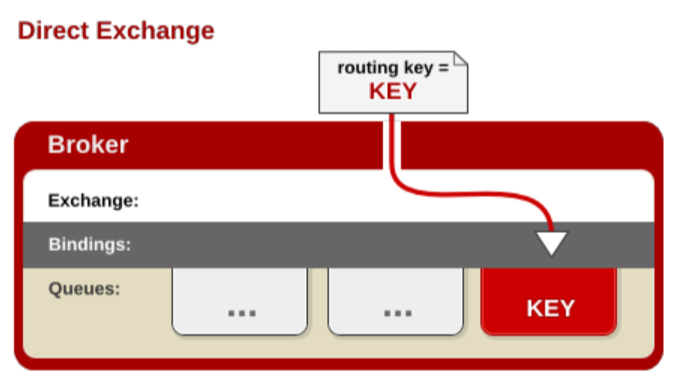
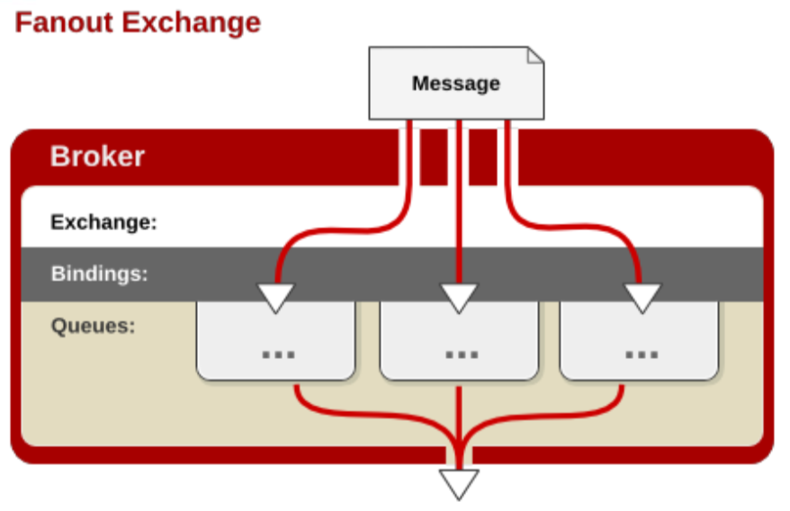
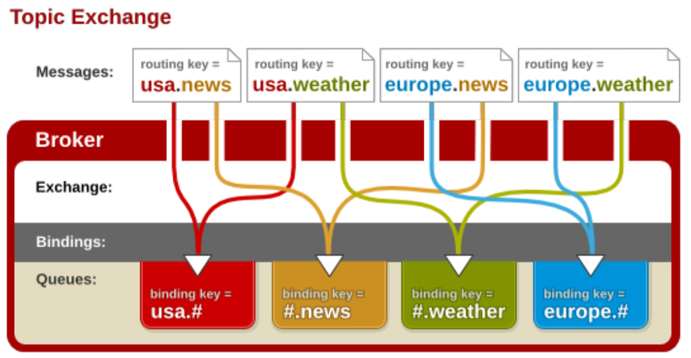

## 1 消息服务规范：JMS&AMQP

### 1.1 消息服务的作用

消息中间见可以用来提升异步通信，扩展解耦能力。

【异步通信】例如，用户注册时，需要将注册信息写入数据库(50ms)，并发送注册邮件(50ms)和注册短信(50ms)。如果采是同步调用，需要150ms相应给用户；如果采用多线程的方式，并发执行发送注册邮件和注册短信，则耗费的时间100ms；如果采用消息队列，当把注册信息写入数据库以后，把接下来的操作写入消息队列(5ms)，写入消息队列的时间是很短的，这样总耗费时间55ms。

【应用解耦】例如，有订单模块和库存模块，用户下单时，需要调用订单系统下单，然后调用库存系统减去库存。使用消息队列，将订单模块和库存模块抽取成两个独立系统，将下单信息写入消息队列中，那么库存系统通过订阅消息队列里的订单的内容，库存系统再来计算库存。

<!-- more -->

【流量削峰】有10万人同时参与秒杀商品，当用户的秒杀直接进入消息队列，消息队列设置只能处理前1万个请求，剩下的请求无法进入队列，抛弃请求，响应秒杀失败。接下来，秒杀业务来处理消息队列里的秒杀请求。

### 1.2 消息服务两个重要概念

**消息代理**（message broker）和**目的地**（destination）。

当消息发送者发送消息后，将由消息代理接管，消息代理保证消息传递到指定目的地。

### 1.3 消息队列两种形式的目的地

1. 队列（queue）：点对点消息通信 point-to-point。
2. 主题（topic）：发布（public）/订阅（subscribe）消息通信。

【点对点式】：消息发送者发送消息，消息代理将其放入一个队列中，消息接收者从队列中获取消息内容，消息读取后被移除队列。

> 注意：消息只有唯一的发送者和**接受者**，但并不是只有一个**接收者**。
>
> 比如A将消息发出，B、C、D都可以接收消息。但是如果一个消息被B接受了，C和D就不能再接受该消息了。（一个消息只能被一个接收者消费）。

【发布订阅式】：发送者（发布者）发送消息到主题（topic），多个接收者（订阅者）监听（订阅）这个主题，那么就会在消息到达时同时收到消息。

> A将一个消息发出，当该消息到达时，B、C、D能同时收到该消息。

### 1.4 两个消息服务规范

【 JMS（Java Message Service）】：Java消息服务：JavaEE规范。

- 基于JVM消息代理的规范。ActiveMQ是JMS的实现。

【AMQP（Advanced Message Queuing Protocol）】：高级消息队列协议。

- 也是消息代理的规范，兼容JMS规范。
- RabbitMQ是AMQP的实现。

【两个消息服务规范的不同】：



> Spring-jms 提供了对JMS的支持。
>
> spring-rabbit提供了对AMQP的支持。

## 2 RabbitMQ

### 2.1 核心概念

一、【Message】：消息。

消息是不具名的，它由**消息头**和**消息体**组成。消息体是不透明的，而消息头则由一系列的可选属性组成，这些属性包括routing-key(路由键)、priority(相对于其他消息的优先权)、delivery-mode(指出该消息可能需要持久性存储)等。

二、【Publisher】：消息生产者。也是一个向交换器发布消息的客户端应用程序。

三、【Exchange】：交换器。用来接收生产者发送的消息并将这些消息路由给服务器中的队列。

Exchange有4种类型:direct(默认)，fanout, topic, 和headers，不同类型的Exchange转发消息的策略有所区别。

四、【Queue】：消息队列。

用来保存消息直到发送给消费者。它是消息的容器，也是消息的终点。一个消息可投入一个或多个队列。消息一直在队列里面，等待消费者连接到这个队列将其取走。

五、【Binding】：绑定，用于消息队列和交换器之间的关联。

一个绑定就是基于路由键将交换器和消息队列连接起来的路由规则，所以可以将交换器理解成一个由绑定构成的路由表。

Exchange 和Queue的绑定可以是多对多的关系。 

> 消息（message）中的路由键（routing key），交换器（Exchange）和队列（queue）的关联（binding）中的binding key。这两个key相对应，或者符合某种匹配规则，queue就可以接受到消息。

六、【Connection】：网络连接。

七、【Channel】：信道。

多路复用连接中的一条独立的双向数据流通道。信道是建立在真实的TCP连接内的虚拟连接，AMQP 命令都是通过信道发出去的，不管是发布消息、订阅队列还是接收消息，这些动作都是通过信道完成。因为对于操作系统来说建立和销毁 TCP 都是非常昂贵的开销，所以引入了信道的概念，以复用一条 TCP 连接。

八、【Consumer】：消息的消费者。表示一个从消息队列中取得消息的客户端应用程序。

九、【Virtual Host】：虚拟主机，表示一批交换器、消息队列和相关对象。虚拟主机是共享相同的身份认证和加密环境的独立服务器域。每个 vhost 本质上就是一个 mini 版的 RabbitMQ 服务器，拥有自己的队列、交换器、绑定和权限机制。vhost 是 AMQP 概念的基础，必须在连接时指定，RabbitMQ 默认的 vhost 是 / 。

十、【Broker】：消息代理。表示消息队列服务器实体。

流程：



消息发布者（publisher），将消息（message）发送给消息代理（broker）服务器里的虚拟主机（virtual host），虚拟主机将消息交给指定的交换器（exchange），交换器根据消息的路由键，将交换器和消息队列（queue）绑定（binding）。当消息到达消息队列后，消费者跟消息队列建立起连接（connection），使用信道（channel）服用tcp连接，从消息队列中拿到的数据通过管道， 获取给消费者。

### 2.2 运行机制：AMQP中的消息路由

AMQP 中消息的路由过程和 JMS 存在一些差别，AMQP 中增加了**Exchange** 和 **Binding** 的角色。生产者把消息发布到 Exchange 上，消息最终到达队列并被消费者接收，而 Binding 决定交换器的消息应该发送到那个队列。



其中，Exchange 分发消息时根据类型的不同分发策略有区别，目前有四种类型，分别是 **direct（默认），fanout、topic、headers**，其中headers匹配AMQP消息的header而不是路由键，headers 交换器和 direct 交换器完全一致，但性能差很多，目前几乎用不到了。

一、【Direct Exchange】：



消息中的路由键（routing key）如果和Binding中的binding key 一致，交换器就将消息发到对应的队列中。路由键与队列名完全匹配，如果一个队列绑定到交换机要求路由键为“dog”，则只转发 routing key 标记为“dog”的消息，不会转发“dog.puppy”，也不会转发“dog.guard”等等。它是完全匹配、**单播**的模式。

这是JMS点对点式的参考实现。

二、【Fanout Exchange】：



每个发到 fanout 类型交换器的消息都会分到所有绑定的队列上去。fanout 交换器不处理路由键， 只是简单的将队列绑定到交换器上，每个发送到交换器的消息都会被转发到与该交换器绑定的所有队列上。很像子网**广播**，每台子网内的主机都获得了一份复制的消息。fanout 类型转发消息是最快的。 

这也是JMS里发布/订阅的参考实现。

三、【Topic Exchange】：



topic 交换器通过模式匹配分配消息的路由键属性，将路由键和某个模式进行匹配，此时队列需要绑定到一个模式上。它将路由键和绑定键的字符串切分成单词，这些单词之间用点隔开。它同样也会识别两个通配符:符`#`和符号`*`。`#`匹配0个或多个单词，`*`匹配一个单词。

### 2.3 Spring Boot 整合 RabbitMQ

#### 2.3.1 自动配置原理

自动配置类：`RabbitAutoConfiguration`。

配置属性类：`RabbitProerties`，前缀：`spring.rabbitmq`。

自动配置的主要组件有：

- `CachingConnectionFactory`：连接工厂。
- `RabbitTemplate`：用来给rabbitmq发送和接受消息。
- `AmqpAdmin`：rabbitmq系统管理功能组件。可用用来声明队列，创建交换器等等。

#### 2.3.2 使用

一、引入依赖：

```xml
<dependency>
    <groupId>org.springframework.boot</groupId>
    <artifactId>spring-boot-starter-amqp</artifactId>
</dependency>
```

二、属性配置

在`application.properties`/`application.yml`中配置：

```properties
spring.rabbitmq.host=192.168.0.100 # 默认 localhost
spring.rabbitmq.port=5672 # 默认5672
spring.rabbitmq.username=guest # 默认guest
spring.rabbitmq.password=guest # 默认guest
```

三、开启基于注解的rabbitmq：

```java
@EnableRabbit
```

> 可以使用`@RabbirListener`监听消息队列的内容。

四、然后就可以使用`RabbitTemplate`发送和接受消息了。

发送消息：

```java
@Autowired
private RabbitTemplate rabbitTempalte;

// 发送消息
public void send() {
    // 方式一：
    // rabbitTemplate.send(exchange, routingKey, message);
    // 其中的message需要自己构造。
    
    // 方式二：
    // rabbitTemplate.convertAndSend(exchange, routingKey, object);
    // 转换并发送，object会自动转换成一个message消息体。
}
```

> 消息对象被默认序列化以后发送出去。

如何将消息序列化为json发送出去：

通过查询`RabbitTemplate`源码我们发现，消息转换器`MessageConverter`默认使用的是`SimpleMessageConverter`，该消息转换器采用了对象输入流的方式进行序列化。

通过自定义消息转换器，使用`Jackson2JsonMessageConverter`。

```java
@Configuration
public class AmqpConfig() {
    @Bean
    public MessageConverter messageConverter() {
        new Jackson2JsonMessageConverter();
    }
}
```

配置后，在`RabbitTemplate`自动配置时，会将我们自定义的`MessageConverter`设置给`RabbitTemplate`。

接受消息：

```java
// 接受消息
public void receive() {
    // 方式一：
    // Message rabbitTemplate.receive(queueName);
    
    // 方式二：
    // Object rabbitTemplate.receiveAndConvert(queueName);
}
```

#### 2.3.3 示例

在开发中，我们常常需要一些监听场景。

Spring 提供了相关的注解：

`@RabbitListener`：监听消息队列。将该注解所标注的方法作为消费消息的方法，目标方法的参数为接受的消息。可以是`Message`。

- `queues`：指定监听的队列，可以是多个。

```java
@RabbitListener(queues = "mq.book")
public void receive(Book book) {
    // book为接受到的消息
}

@RabbitListener(queues = "mq.book")
public void receive(Message message) {
    // message 为接受的消息
    message.getBody(); // 获取消息头
    message.getMessageProperties(); // 获取消息内容
}
```

#### 2.3.4 AmqpAdmin 管理组件

AmqpAdmin可以创建、删除：Queue、Exchange，Binding。

```java
@Autowired
private AmqpAdmin amqpAdmin;

public void createExchange() {
    // 创建一个DirectExchange，名称为amqpadmin.exchange
    amqpAdmin.declareExchange(new DirectExchange("amqpadmin.exchange"));
}

public void createQueue() {
    // 创建一个持久化的、名称为amqpadmin.queue的队列。
    amqpAdmin.declareQueue(new Queue("amqpadmin.queue", true));
}

public void createBinding() {
    // 创建一个绑定：目的地：amqpadmin.queue，目的地类型：queue，交换器：amqpadmin.exchang，路由键：amqp:xixi
    amqpAdmin.declareBinding(new Binding("amqpadmin.queue", Binding.DestinationType.QUEUE, "amqpadmin.exchange", "amqp:xixi", null));
}
```

